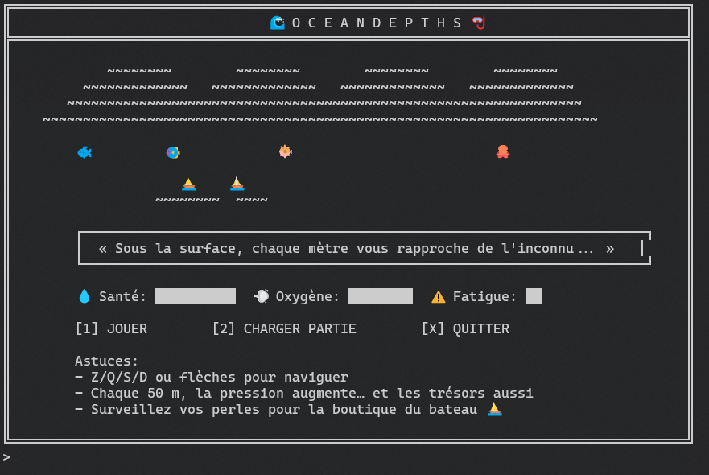
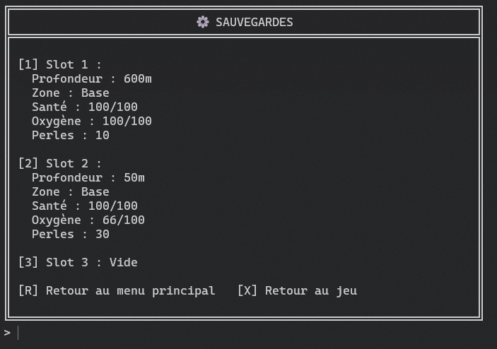
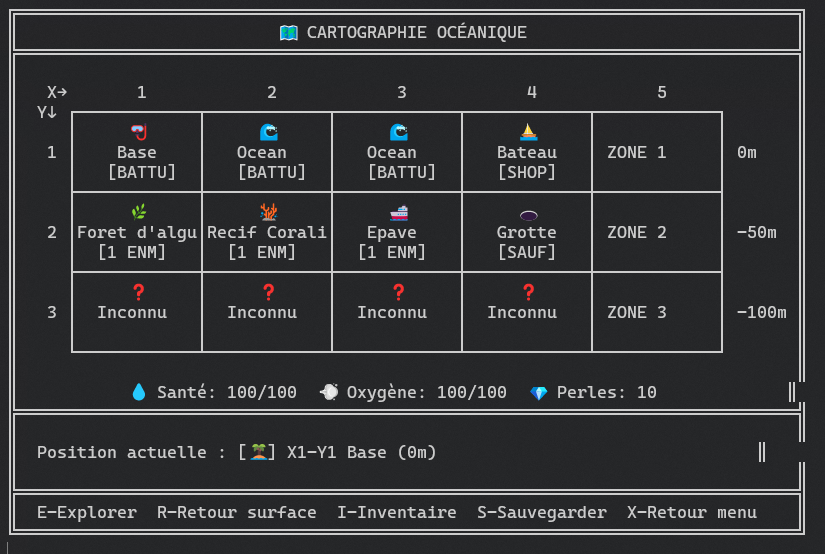
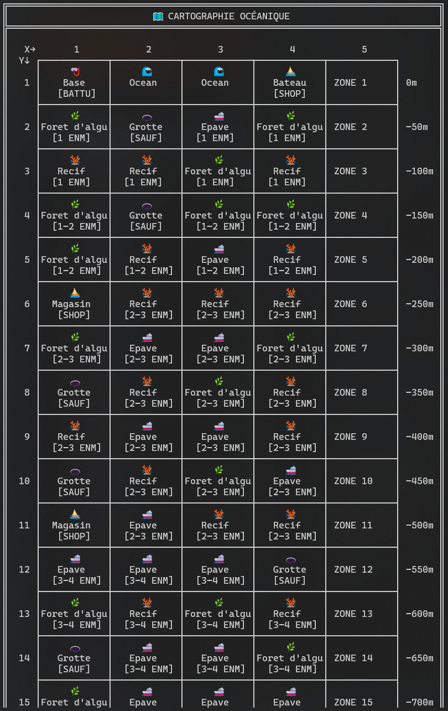
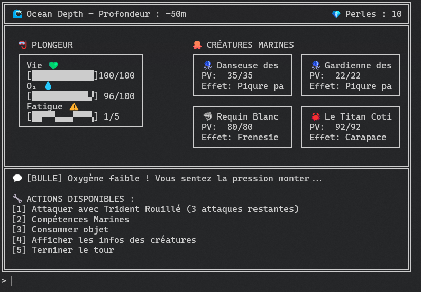

# Progression OceanDepths

## Fonctionnalités implémentées

### Menu principal

- [X] Affichage du menu principal
- [X] Gérer les inputs

### Monstres

- [X] Génération d'une créature
- [ ] Effets spéciaux des créatures
    - Manque Méduse
- [X] Génération aléatoire de créatures pour une zone

### Joueur

- [X] Initialisation du joueur
- [X] Gestion des ressources (vie, oxygne, fatigue)

### Inventaire

- [X] Affichage de l'inventaire
- [X] Gestion inputs
- [ ] Gestion équipements et consommables

### Combats

- [X] Affichage combat
- [ ] Afficher les logs du combat
- [X] Gestion des tours (ordre des actions)
- [X] Gestion des actions joueur
- [X] Gestion de la fatigue
- [X] Gestion de l'oxygène
- [X] Calcule des dégâts
- [X] Conséquences des attaques

### Système de récompenses

- [X] Affichage
- [X] Ajout des récompenses à l'inventaire/joueur

### Sauvegarde/Chargement

#### Sauvegarde

- [X] Affichage du menu de sauvegarde
- [X] Sauvegarde possible uniquement en surface ou dans une grotte
- [X] Sauvegarde du joueur
- [X] Sauvegarde de l'inventaire
- [X] Sauvegarde des zones

#### Chargement

- [X] Chargement du joueur
- [X] Chargement de l'inventaire
- [X] Chargement des créatures
- [X] Chargement des zones

### Compétences

- [ ] Affichage des compétences
- [ ] Gestion des inputs
- [ ] Utilisation des compétences en combat

### Map

- [X] Affichage de la map
- [X] Gestion des déplacements
- [X] Retour en surface
- [ ] Détail d'une zone

### Zones

#### Types de zones

- [X] Surface : Sauvegarde, boutique, repos complet
- [X] Récifs : Créatures faciles, équipement de base
- [X] Épaves : Trésors, créatures moyennes, équipements rares
- [X] Forêts d'algues : Labyrinthique, créatures qui se cachent
- [X] Grottes : Sécurisées, cristaux d'oxygène, sauvegarde
- [ ] Fosses : Créatures légendaires, équipements exceptionnels

#### Mécaniques d'exploration

- [X] Chaque déplacement consomme de l'oxygène selon la distance
- [X] Plus la profondeur augmente, plus l'oxygène se consomme vite
- [ ] Certaines zones nécessitent un équipement minimum
- [X] Les zones inconnues se débloquent par progression

### Étapes

- [X] Étape 1 : Génération créatures
- [X] Étape 2 : Attaque joueur
- [X] Étape 3 : Attaque créatures
- [X] Étape 4 : Récompenses
- [X] Étape 5 : Sauvegarde/Chargement
- [ ] Étape 6 : Compétences
- [X] Étape 7 : Map/Zones

## Captures d'écran

### Menu principal

### Menu des sauvegardes

### Game

### Map

### Combat

## Difficultés rencontrées

- Problème avec l'affichage (Pas facile à gérer avec les tailles différentes et emoji, etc.)
